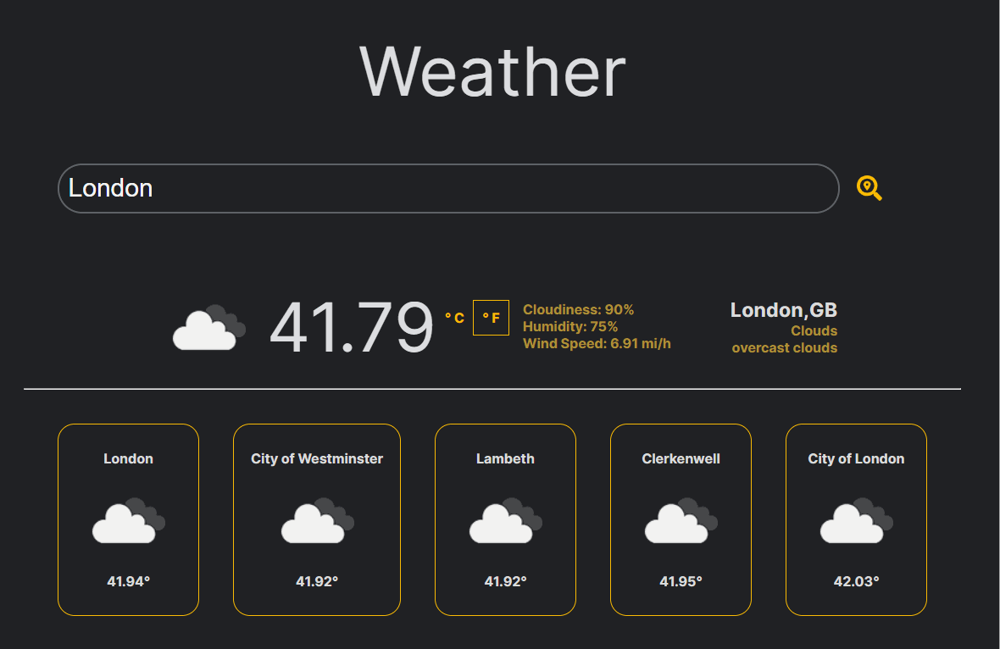

# Weather App

A weather application made using React and the Open Weather Map API

This project was bootstrapped with [Create React App](https://github.com/facebook/create-react-app).



## Getting Started

These instructions will get you a copy of the project up and running on your local machine.

### Prerequisites

- [nodejs](https://nodejs.org/en/)

## Usage

1. Clone the repository.
1. Install the required packages.
1. Head to [OpenWeatherMap](https://nodejs.org/en/) and get an API key.
1. Assing the value of the API key to the auth variable in `./react-weather-app/src/App.js`.
1. Run the project.

### Assigning the auth variable value

```js
function App() {
  ...
  const auth = REACT_APP_API_KEY; //Replace API key here
  ...
```

## Available Scripts

In the project directory, you can run:

### `npm install`

Install the required packages.

### `npm start`

Runs the app in the development mode.\
Open [http://localhost:3000](http://localhost:3000) to view it in the browser.

## Authors

- **Liul Alemayehu** - _Initial work_
